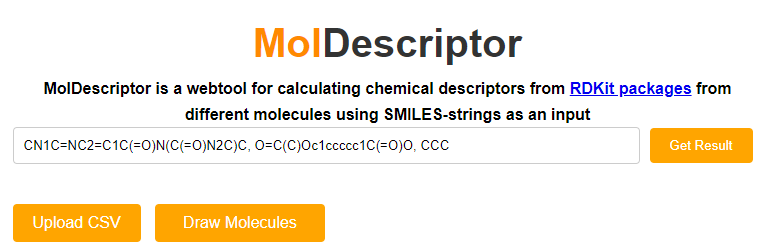
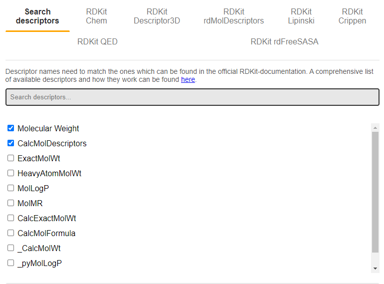

# Getting started with MolDescriptor

### What is this document?

In this document we will give a very basic example on how you can use MolDescriptor to obtain [molecular descriptors](https://en.wikipedia.org/wiki/Molecular_descriptor) of molecular structures - no coding required!

### Step 0: Obtaining a SMILES code

The first step to obtaining the information you need from MolDescriptor is to identify the [Simplified Molecular Input Line Entry System (SMILES)](https://en.wikipedia.org/wiki/Simplified_Molecular_Input_Line_Entry_System) code of the compound(s) you wish to base your calculations on. SMILES-codes are text-based (aka. "string") representations of molecular structures. While organic molecules can be complex, three-dimensional entities, this string representation is able to cover the most import aspects necessary for the majority of cheminformatic calculations - but you should be wary that there are some cases where a SMILES-representation may fail to be the best representation of a molecular structure.

#### How do I obtain the corresponding SMILES-codes for the corresponding molecular structures I'm working with?

- Many commonly known organic compounds (e.g. [caffeine](https://en.wikipedia.org/wiki/Caffeine), [aspirin](https://en.wikipedia.org/wiki/Aspirin) or [propane](https://en.wikipedia.org/wiki/Propane)) usually have their corresponding SMILES-code listed on their Wikipedia-pages. 
- Online databases, [such as PubChem](https://pubchem.ncbi.nlm.nih.gov/), offer a wide overview of many known chemical structures.
- If you are familiar with the chemical structure, you can directly draw this in the MolDescriptor website. In the current build of MolDescriptor, only one drawn structure can be entered at the time. <!-- is this correct?-->
-  Online tools such as the [SMILES-generator from cheminfo](https://www.cheminfo.org/flavor/malaria/Utilities/SMILES_generator___checker/index.html#) allows you to draw the structure and generates the corresponding SMILES code in real time.

### Step 1: Enter SMILES code on MolDescriptor

In the first text box, enter the SMILES string of the molecular structure you wish to obtain. If you wish to calculate descriptors for multiple structures, you can separate them by a comma. In the above example, the SMILES codes for caffeine, aspirin and propane are entered.

### Step 2: Choose which descriptors you would like to calculate

Now it is time to specify which descriptors should be calculated in MolDescriptor. The easiest way to do this is by using the search function ("Search descriptors"), and type in the name of whatever you want to calculate in the text bar. In the above example, molecular weight and a set of general descriptors ("CalcMolDescriptors") are selected.

Note: In the current build of MolDescriptors, it is only possible to search and match the exact name of each descriptor as provided by RDKit. For a comprehensive list of all the available descriptors from RDKit, [see here](https://rdkit.org/docs/source/rdkit.Chem.html)

Click the "Get Result" button to calculate the descriptors

### Step 3: View results

Will update this section when CalcMolDescriptors is fixed

## Key features of MolDescriptors
- Calculating molecular descriptors from SMILES
- Calculating molecular descriptors from a CSV file containing SMILES
- Downloading SMILES with calculated descriptors as a CSV file

